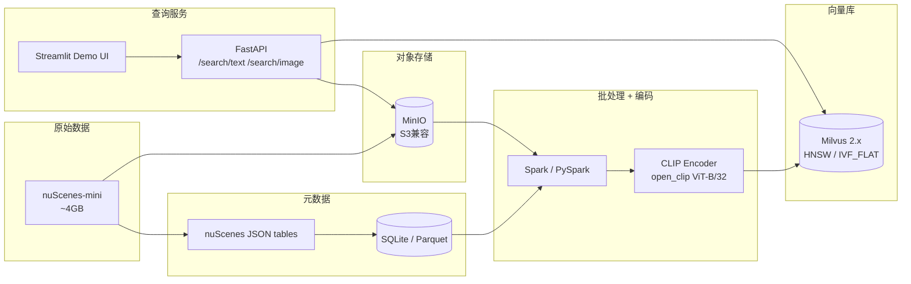

# 跨模态检索实战 Pipeline（nuScenes + MinIO + Spark + CLIP + Milvus）

> 目标：用一份可复制、可分步执行的指南，搭起一条**"自动驾驶数据 → 多模态向量 → 跨模态检索"**的最小可用系统。
>
> 完成本指南后，你能做：
> - 用文字查图：`"rainy night with a pedestrian crossing the street"` → 返回 Top-K 帧
> - 用图查图：上传一张图 → 返回视觉相似帧
> - 按场景属性过滤："雨天" / "包含自行车" 等
> - LiDAR 点云投影到相机图像上做可视化校验

---

## 0. 全局架构



**关键设计原则**
- **MinIO 当唯一数据源 of truth**：所有图像/点云从 MinIO 读，结果写回 MinIO；本地磁盘只做缓存。
- **元数据和向量分离**：场景属性（天气、是否含自行车）走结构化表（Parquet/SQLite）；向量走 Milvus；用 `sample_token` 做主键串联。
- **Spark 只做批处理**：mini 数据集其实单机就够，但我们用 Spark 是为了**演练真正上规模的 ETL 形态**。
- **CLIP 输出统一 L2 归一化**：Milvus 用 `IP`（Inner Product）= 余弦相似度。

---

## 1. 环境准备（Phase 0）

### 1.1 硬件 / 软件最低要求
| 项 | 要求 |
|---|---|
| OS | Windows 10/11 (WSL2 推荐) / macOS / Linux |
| 内存 | ≥ 16GB（Docker 分 8GB+） |
| 磁盘 | ≥ 50GB 空闲 |
| GPU | 可选；CPU 也能跑 mini 数据集（~30 分钟编码完） |
| Python | 3.10（CLIP 生态最稳） |
| Docker Desktop | 最新版 |

### 1.2 创建工作目录
```powershell
# Windows PowerShell
$ROOT = "C:\projects\multimodal-search"
mkdir $ROOT
cd $ROOT
mkdir data, code, configs, notebooks, output
```

后续所有路径都假设当前目录是 `C:\projects\multimodal-search`。

### 1.3 Python 虚拟环境
```powershell
python -m venv .venv
.\.venv\Scripts\Activate.ps1
python -m pip install --upgrade pip
```

新建 `requirements.txt`：
```text
# 数据 & 工具
nuscenes-devkit==1.1.11
numpy<2.0
pandas
pyarrow
pillow
opencv-python
matplotlib
tqdm
boto3
minio
python-dotenv

# 模型
torch                # 如有 GPU：装对应 CUDA 版本
torchvision
open_clip_torch==2.24.0

# 检索 / 处理
pyspark==3.5.1
pymilvus==2.4.4

# 服务
fastapi
uvicorn[standard]
streamlit
```

```powershell
pip install -r requirements.txt
```

> ⚠️ Windows 上 `pyspark` 需要 JDK 17 + winutils。如果你嫌麻烦，**先跳过 Spark**，在 Phase 6 用纯 Python 多进程版替代，业务逻辑一样。

---

## 2. 启动基础设施（Phase 1）

### 2.1 `docker-compose.yml`
保存到 `configs/docker-compose.yml`：

```yaml
version: '3.8'
services:
  # ---- MinIO：S3 兼容对象存储 ----
  minio:
    image: minio/minio:latest
    container_name: minio
    ports:
      - "9000:9000"   # S3 API
      - "9001:9001"   # Web Console
    environment:
      MINIO_ROOT_USER: minioadmin
      MINIO_ROOT_PASSWORD: minioadmin
    volumes:
      - minio_data:/data
    command: server /data --console-address ":9001"

  # ---- Milvus 依赖 ----
  etcd:
    image: quay.io/coreos/etcd:v3.5.5
    environment:
      - ETCD_AUTO_COMPACTION_MODE=revision
      - ETCD_AUTO_COMPACTION_RETENTION=1000
      - ETCD_QUOTA_BACKEND_BYTES=4294967296
    volumes:
      - etcd_data:/etcd
    command: etcd -advertise-client-urls=http://127.0.0.1:2379 -listen-client-urls http://0.0.0.0:2379 --data-dir /etcd

  # ---- Milvus 自带 minio（独立实例，避免和上面那个混用）----
  milvus-minio:
    image: minio/minio:latest
    container_name: milvus-minio
    environment:
      MINIO_ACCESS_KEY: minioadmin
      MINIO_SECRET_KEY: minioadmin
    volumes:
      - milvus_minio_data:/minio_data
    command: minio server /minio_data

  # ---- Milvus standalone ----
  milvus:
    image: milvusdb/milvus:v2.4.5
    container_name: milvus
    command: ["milvus", "run", "standalone"]
    environment:
      ETCD_ENDPOINTS: etcd:2379
      MINIO_ADDRESS: milvus-minio:9000
    ports:
      - "19530:19530"   # gRPC
      - "9091:9091"     # HTTP metrics
    depends_on:
      - etcd
      - milvus-minio

  # ---- Attu：Milvus Web GUI（可选但强烈推荐）----
  attu:
    image: zilliz/attu:v2.4
    container_name: attu
    ports:
      - "8000:3000"
    environment:
      MILVUS_URL: milvus:19530
    depends_on:
      - milvus

volumes:
  minio_data:
  etcd_data:
  milvus_minio_data:
```

### 2.2 启动
```powershell
cd configs
docker compose up -d
docker compose ps
```

### 2.3 健康检查
- MinIO 控制台：http://localhost:9001 （minioadmin / minioadmin）
- Attu (Milvus GUI)：http://localhost:8000
- Milvus gRPC：`localhost:19530`

### 2.4 在 MinIO 里创建 bucket
登录 MinIO Console → 新建两个 bucket：
- `nuscenes-raw`：放原始数据
- `nuscenes-derived`：放投影图、缩略图等衍生产物

---

## 3. 下载 nuScenes mini（Phase 2）

### 3.1 下载
1. 注册账号：https://www.nuscenes.org/nuscenes#download
2. 下载 **"v1.0-mini"**（约 4GB）：
   - `v1.0-mini.tgz`（元数据 + 10 个场景的全部数据）
3. 解压到 `data/nuscenes/`，最终目录：
```
data/nuscenes/
├── maps/
├── samples/          # 关键帧（10Hz 中抽出的 2Hz）
│   ├── CAM_FRONT/
│   ├── CAM_BACK/
│   ├── LIDAR_TOP/
│   └── ...
├── sweeps/           # 非关键帧
└── v1.0-mini/        # JSON 元数据表
    ├── scene.json
    ├── sample.json
    ├── sample_data.json
    ├── sample_annotation.json
    └── ...
```

### 3.2 快速验证 devkit 能读
新建 `notebooks/01_explore.py`：
```python
from nuscenes.nuscenes import NuScenes

nusc = NuScenes(version='v1.0-mini', dataroot='data/nuscenes', verbose=True)
print(f"Scenes: {len(nusc.scene)}, Samples: {len(nusc.sample)}")
nusc.list_scenes()
```
```powershell
python notebooks/01_explore.py
```
能列出 10 个场景就 OK。

---

## 4. 上传原始数据到 MinIO（Phase 3）

> 这一步把"本地文件夹"变成"对象存储"。生产环境里数据本来就在 S3/MinIO，这里我们模拟。

新建 `code/upload_to_minio.py`：

```python
"""上传 nuScenes mini 到 MinIO 的 nuscenes-raw bucket。"""
import os
from pathlib import Path
from minio import Minio
from tqdm import tqdm

MINIO_ENDPOINT = "localhost:9000"
ACCESS_KEY = "minioadmin"
SECRET_KEY = "minioadmin"
BUCKET = "nuscenes-raw"
LOCAL_ROOT = Path("data/nuscenes")

client = Minio(MINIO_ENDPOINT, access_key=ACCESS_KEY, secret_key=SECRET_KEY, secure=False)

if not client.bucket_exists(BUCKET):
    client.make_bucket(BUCKET)

files = [p for p in LOCAL_ROOT.rglob("*") if p.is_file()]
print(f"Uploading {len(files)} files...")

for fp in tqdm(files):
    key = fp.relative_to(LOCAL_ROOT).as_posix()  # e.g. samples/CAM_FRONT/xxx.jpg
    client.fput_object(BUCKET, key, str(fp))

print("Done.")
```

```powershell
python code/upload_to_minio.py
```

完成后 MinIO Console 里 `nuscenes-raw` 应该看到 `samples/`、`sweeps/`、`v1.0-mini/` 三个前缀。

---

## 5. 元数据解析与场景过滤（Phase 4）

目标：把 nuScenes 的 JSON 表压成一张**宽表**，含每个 sample 的：
- `sample_token`
- `scene_token`, `scene_description`（含 "rain", "night" 等关键字）
- `cam_front_key`（MinIO 中相机图的 object key）
- `lidar_top_key`（MinIO 中点云的 object key）
- `timestamp`
- `has_bicycle`（是否有 `vehicle.bicycle` 标注）
- `is_rainy`, `is_night`（从 description 解析）

新建 `code/build_metadata.py`：

```python
"""把 nuScenes JSON 表转成宽表 Parquet，存到 output/metadata.parquet。"""
from pathlib import Path
import pandas as pd
from nuscenes.nuscenes import NuScenes

nusc = NuScenes(version='v1.0-mini', dataroot='data/nuscenes', verbose=False)

rows = []
for sample in nusc.sample:
    scene = nusc.get('scene', sample['scene_token'])
    desc = scene['description'].lower()

    cam_data = nusc.get('sample_data', sample['data']['CAM_FRONT'])
    lidar_data = nusc.get('sample_data', sample['data']['LIDAR_TOP'])

    # 是否包含自行车
    has_bicycle = any(
        nusc.get('sample_annotation', tok)['category_name'].startswith('vehicle.bicycle')
        for tok in sample['anns']
    )

    rows.append({
        'sample_token': sample['token'],
        'scene_token': sample['scene_token'],
        'scene_name': scene['name'],
        'scene_description': scene['description'],
        'timestamp': sample['timestamp'],
        'cam_front_key': cam_data['filename'],      # samples/CAM_FRONT/xxx.jpg
        'lidar_top_key': lidar_data['filename'],    # samples/LIDAR_TOP/xxx.pcd.bin
        'is_rainy': 'rain' in desc,
        'is_night': 'night' in desc,
        'has_bicycle': has_bicycle,
    })

df = pd.DataFrame(rows)
print(df.head())
print(f"\nTotal samples: {len(df)}")
print(f"Rainy: {df.is_rainy.sum()}, Night: {df.is_night.sum()}, With bicycle: {df.has_bicycle.sum()}")

Path('output').mkdir(exist_ok=True)
df.to_parquet('output/metadata.parquet', index=False)
print("Saved -> output/metadata.parquet")
```

```powershell
python code/build_metadata.py
```

输出示例：
```
Total samples: 404
Rainy: 0, Night: 81, With bicycle: 23
```
> mini 集场景少，可能没有 "rainy"。完整 trainval 集才有真正的雨天场景。逻辑通就行。

---

## 6. LiDAR → 相机图像投影（Phase 5，验证 + 可视化）

这一步**不是检索必须**，但是：
1. 让你直观理解 sensor fusion 的几何关系（外参 / 内参）
2. 给后面"3D 检测框投影到 2D 图"打地基

新建 `code/project_lidar.py`：

```python
"""把 LIDAR_TOP 的点云投影到 CAM_FRONT 图像上，按深度上色，保存到 output/projections/。"""
from pathlib import Path
import numpy as np
import matplotlib.pyplot as plt
from PIL import Image
from nuscenes.nuscenes import NuScenes
from nuscenes.utils.geometry_utils import view_points
from pyquaternion import Quaternion
from nuscenes.utils.data_classes import LidarPointCloud

nusc = NuScenes(version='v1.0-mini', dataroot='data/nuscenes', verbose=False)
out_dir = Path('output/projections')
out_dir.mkdir(parents=True, exist_ok=True)

# 取前 10 个 sample 做演示
for sample in nusc.sample[:10]:
    cam_token = sample['data']['CAM_FRONT']
    lidar_token = sample['data']['LIDAR_TOP']

    # 用 devkit 一行搞定投影（内部已处理 ego pose + sensor calibration）
    points, coloring, im = nusc.explorer.map_pointcloud_to_image(
        pointsensor_token=lidar_token,
        camera_token=cam_token,
    )

    fig, ax = plt.subplots(figsize=(12, 7))
    ax.imshow(im)
    ax.scatter(points[0, :], points[1, :], c=coloring, s=2, cmap='jet')
    ax.axis('off')

    out_path = out_dir / f"{sample['token']}.png"
    fig.savefig(out_path, bbox_inches='tight', pad_inches=0, dpi=120)
    plt.close(fig)
    print(f"Saved {out_path}")
```

```powershell
python code/project_lidar.py
```

`output/projections/*.png` 里你会看到**点云按深度（近=红，远=蓝）画在相机图像上**。这是"sensor fusion 数据可用性"最直观的体检。

---

## 7. 用 Spark + CLIP 提取图像特征（Phase 6）

> 如果 Spark 装不上，跳到 7.B "纯 Python 版"。

### 7.A Spark 版

新建 `code/encode_clip_spark.py`：

```python
"""Spark + Pandas UDF 批量提取 CLIP 图像特征，结果写到 MinIO 的 Parquet。"""
import io
import numpy as np
import pandas as pd
import torch
from PIL import Image
import open_clip
from pyspark.sql import SparkSession
from pyspark.sql.functions import pandas_udf, col
from pyspark.sql.types import ArrayType, FloatType
from minio import Minio

# ---- Spark 连接 MinIO 当 S3A ----
spark = (
    SparkSession.builder
    .appName("clip-encode")
    .config("spark.jars.packages",
            "org.apache.hadoop:hadoop-aws:3.3.4,com.amazonaws:aws-java-sdk-bundle:1.12.262")
    .config("spark.hadoop.fs.s3a.endpoint", "http://localhost:9000")
    .config("spark.hadoop.fs.s3a.access.key", "minioadmin")
    .config("spark.hadoop.fs.s3a.secret.key", "minioadmin")
    .config("spark.hadoop.fs.s3a.path.style.access", "true")
    .config("spark.hadoop.fs.s3a.impl", "org.apache.hadoop.fs.s3a.S3AFileSystem")
    .getOrCreate()
)

# ---- 读取元数据宽表 ----
meta = spark.read.parquet("output/metadata.parquet").select("sample_token", "cam_front_key")
print(f"To encode: {meta.count()} images")

# ---- Pandas UDF：每个 partition 加载一次模型 ----
@pandas_udf(ArrayType(FloatType()))
def clip_encode_udf(keys: pd.Series) -> pd.Series:
    device = "cuda" if torch.cuda.is_available() else "cpu"
    model, _, preprocess = open_clip.create_model_and_transforms(
        'ViT-B-32', pretrained='laion2b_s34b_b79k'
    )
    model = model.to(device).eval()

    client = Minio("localhost:9000", access_key="minioadmin",
                   secret_key="minioadmin", secure=False)

    vectors = []
    batch_imgs, batch_idx = [], []
    BATCH = 32

    def flush():
        if not batch_imgs:
            return
        with torch.no_grad():
            x = torch.stack(batch_imgs).to(device)
            feats = model.encode_image(x)
            feats = feats / feats.norm(dim=-1, keepdim=True)  # L2 normalize
        for v in feats.cpu().numpy():
            vectors.append(v.astype(np.float32).tolist())
        batch_imgs.clear()

    for key in keys:
        resp = client.get_object("nuscenes-raw", key)
        try:
            img = Image.open(io.BytesIO(resp.read())).convert("RGB")
        finally:
            resp.close(); resp.release_conn()
        batch_imgs.append(preprocess(img))
        if len(batch_imgs) >= BATCH:
            flush()
    flush()
    return pd.Series(vectors)

encoded = meta.withColumn("embedding", clip_encode_udf(col("cam_front_key")))
encoded.write.mode("overwrite").parquet("output/embeddings.parquet")
print("Saved -> output/embeddings.parquet")
spark.stop()
```

```powershell
python code/encode_clip_spark.py
```

### 7.B 纯 Python 版（无 Spark，推荐先用这个跑通）

新建 `code/encode_clip_simple.py`：

```python
"""纯 Python 版 CLIP 编码，不依赖 Spark。"""
import io
import numpy as np
import pandas as pd
import torch
from PIL import Image
from tqdm import tqdm
import open_clip
from minio import Minio

meta = pd.read_parquet("output/metadata.parquet")
device = "cuda" if torch.cuda.is_available() else "cpu"
print(f"Device: {device}")

model, _, preprocess = open_clip.create_model_and_transforms(
    'ViT-B-32', pretrained='laion2b_s34b_b79k'
)
model = model.to(device).eval()

client = Minio("localhost:9000", access_key="minioadmin",
               secret_key="minioadmin", secure=False)

BATCH = 32
all_vecs = []
keys = meta["cam_front_key"].tolist()

for i in tqdm(range(0, len(keys), BATCH)):
    batch_keys = keys[i:i+BATCH]
    imgs = []
    for k in batch_keys:
        resp = client.get_object("nuscenes-raw", k)
        try:
            img = Image.open(io.BytesIO(resp.read())).convert("RGB")
        finally:
            resp.close(); resp.release_conn()
        imgs.append(preprocess(img))
    x = torch.stack(imgs).to(device)
    with torch.no_grad():
        feats = model.encode_image(x)
        feats = feats / feats.norm(dim=-1, keepdim=True)
    all_vecs.append(feats.cpu().numpy())

embeddings = np.concatenate(all_vecs, axis=0).astype(np.float32)
print("Embeddings shape:", embeddings.shape)  # (N, 512)

meta["embedding"] = list(embeddings)
meta.to_parquet("output/embeddings.parquet", index=False)
print("Saved -> output/embeddings.parquet")
```

```powershell
python code/encode_clip_simple.py
```

CPU 上 mini 集大约 5–10 分钟。

---

## 8. 把向量写入 Milvus（Phase 7）

新建 `code/index_milvus.py`：

```python
"""创建 Milvus collection 并导入 CLIP 向量。"""
import pandas as pd
import numpy as np
from pymilvus import (
    connections, utility, FieldSchema, CollectionSchema,
    DataType, Collection,
)

COLLECTION = "nuscenes_cam_front"
DIM = 512

connections.connect(alias="default", host="localhost", port="19530")

if utility.has_collection(COLLECTION):
    utility.drop_collection(COLLECTION)

fields = [
    FieldSchema(name="pk",            dtype=DataType.INT64,  is_primary=True, auto_id=True),
    FieldSchema(name="sample_token",  dtype=DataType.VARCHAR, max_length=64),
    FieldSchema(name="scene_name",    dtype=DataType.VARCHAR, max_length=32),
    FieldSchema(name="cam_front_key", dtype=DataType.VARCHAR, max_length=256),
    FieldSchema(name="is_rainy",      dtype=DataType.BOOL),
    FieldSchema(name="is_night",      dtype=DataType.BOOL),
    FieldSchema(name="has_bicycle",   dtype=DataType.BOOL),
    FieldSchema(name="embedding",     dtype=DataType.FLOAT_VECTOR, dim=DIM),
]
schema = CollectionSchema(fields, description="nuScenes CAM_FRONT CLIP embeddings")
coll = Collection(name=COLLECTION, schema=schema)

# 索引：HNSW + 内积（向量已归一化 => 余弦相似度）
coll.create_index(
    field_name="embedding",
    index_params={
        "index_type": "HNSW",
        "metric_type": "IP",
        "params": {"M": 16, "efConstruction": 200},
    },
)

# 插入数据
df = pd.read_parquet("output/embeddings.parquet")
print(f"Inserting {len(df)} rows...")

coll.insert([
    df["sample_token"].tolist(),
    df["scene_name"].tolist(),
    df["cam_front_key"].tolist(),
    df["is_rainy"].tolist(),
    df["is_night"].tolist(),
    df["has_bicycle"].tolist(),
    [np.array(v, dtype=np.float32).tolist() for v in df["embedding"]],
])
coll.flush()
coll.load()

print(f"Inserted. Row count: {coll.num_entities}")
```

```powershell
python code/index_milvus.py
```

打开 Attu (http://localhost:8000) 应该能看到 `nuscenes_cam_front` collection，含 ~404 行。

---

## 9. 跨模态查询（Phase 8）

### 9.1 命令行查询脚本
新建 `code/search_cli.py`：

```python
"""命令行跨模态检索 demo。"""
import argparse, io
import numpy as np
import torch
from PIL import Image
import open_clip
from pymilvus import connections, Collection
from minio import Minio

COLLECTION = "nuscenes_cam_front"

def get_text_vec(text: str) -> np.ndarray:
    device = "cuda" if torch.cuda.is_available() else "cpu"
    model, _, _ = open_clip.create_model_and_transforms('ViT-B-32', pretrained='laion2b_s34b_b79k')
    tok = open_clip.get_tokenizer('ViT-B-32')
    model = model.to(device).eval()
    with torch.no_grad():
        v = model.encode_text(tok([text]).to(device))
        v = v / v.norm(dim=-1, keepdim=True)
    return v.cpu().numpy().astype(np.float32)[0]

def search(vec: np.ndarray, top_k=5, expr: str | None = None):
    connections.connect(host="localhost", port="19530")
    coll = Collection(COLLECTION); coll.load()
    results = coll.search(
        data=[vec.tolist()],
        anns_field="embedding",
        param={"metric_type": "IP", "params": {"ef": 64}},
        limit=top_k,
        expr=expr,
        output_fields=["sample_token", "scene_name", "cam_front_key",
                       "is_night", "has_bicycle"],
    )
    for hit in results[0]:
        print(f"score={hit.score:.4f}  scene={hit.entity.get('scene_name')}  "
              f"night={hit.entity.get('is_night')}  bicycle={hit.entity.get('has_bicycle')}  "
              f"key={hit.entity.get('cam_front_key')}")

if __name__ == "__main__":
    parser = argparse.ArgumentParser()
    parser.add_argument("--text", type=str, help="文本查询")
    parser.add_argument("--top", type=int, default=5)
    parser.add_argument("--filter", type=str, default=None,
                        help="Milvus 布尔表达式，例如 is_night == true")
    args = parser.parse_args()

    vec = get_text_vec(args.text)
    search(vec, top_k=args.top, expr=args.filter)
```

### 9.2 试几个查询

```powershell
# 自由文本
python code/search_cli.py --text "a car driving at night with street lights"

# 文本 + 结构化过滤（夜间场景）
python code/search_cli.py --text "pedestrians on the sidewalk" --filter "is_night == true"

# 找含自行车的场景（结构化筛 + 视觉相似）
python code/search_cli.py --text "cyclist on the road" --filter "has_bicycle == true"
```

这就是**"向量相似度 + 结构化过滤"混合检索**的最小形态，也是真实业务的常见姿势。

---

## 10. FastAPI 服务化（Phase 8.5）

新建 `code/server.py`：

```python
"""把检索包装成 HTTP 服务。"""
from datetime import timedelta
import io
import numpy as np
import torch
from fastapi import FastAPI, UploadFile, File, Form
from PIL import Image
import open_clip
from pymilvus import connections, Collection
from minio import Minio

COLLECTION = "nuscenes_cam_front"
device = "cuda" if torch.cuda.is_available() else "cpu"

model, _, preprocess = open_clip.create_model_and_transforms('ViT-B-32', pretrained='laion2b_s34b_b79k')
tokenizer = open_clip.get_tokenizer('ViT-B-32')
model = model.to(device).eval()

connections.connect(host="localhost", port="19530")
coll = Collection(COLLECTION); coll.load()
minio_client = Minio("localhost:9000", access_key="minioadmin", secret_key="minioadmin", secure=False)

app = FastAPI(title="Multimodal Search")

def _encode_text(text: str) -> np.ndarray:
    with torch.no_grad():
        v = model.encode_text(tokenizer([text]).to(device))
        v = v / v.norm(dim=-1, keepdim=True)
    return v.cpu().numpy().astype(np.float32)[0]

def _encode_image(raw: bytes) -> np.ndarray:
    img = Image.open(io.BytesIO(raw)).convert("RGB")
    with torch.no_grad():
        v = model.encode_image(preprocess(img).unsqueeze(0).to(device))
        v = v / v.norm(dim=-1, keepdim=True)
    return v.cpu().numpy().astype(np.float32)[0]

def _search(vec, top_k, expr):
    res = coll.search(
        data=[vec.tolist()], anns_field="embedding",
        param={"metric_type": "IP", "params": {"ef": 64}},
        limit=top_k, expr=expr,
        output_fields=["sample_token", "scene_name", "cam_front_key",
                       "is_night", "has_bicycle"],
    )
    hits = []
    for hit in res[0]:
        key = hit.entity.get("cam_front_key")
        url = minio_client.presigned_get_object(
            "nuscenes-raw", key, expires=timedelta(hours=1)
        )
        hits.append({
            "score": float(hit.score),
            "scene": hit.entity.get("scene_name"),
            "night": hit.entity.get("is_night"),
            "bicycle": hit.entity.get("has_bicycle"),
            "key": key,
            "image_url": url,
        })
    return hits

@app.post("/search/text")
def search_text(text: str = Form(...), top_k: int = Form(5), expr: str | None = Form(None)):
    return {"results": _search(_encode_text(text), top_k, expr)}

@app.post("/search/image")
def search_image(file: UploadFile = File(...), top_k: int = Form(5), expr: str | None = Form(None)):
    return {"results": _search(_encode_image(file.file.read()), top_k, expr)}
```

启动：
```powershell
uvicorn code.server:app --reload --port 8080
```

试：
```powershell
curl -X POST "http://localhost:8080/search/text" `
     -F "text=cars stopped at red traffic light" `
     -F "top_k=5"
```

返回里 `image_url` 是 MinIO 的**预签名 URL**，可以直接在浏览器打开看图。

---

## 11. Streamlit Demo UI（Phase 8.6，可选）

新建 `code/ui.py`：

```python
import streamlit as st
import requests

st.set_page_config(page_title="Multimodal Search", layout="wide")
st.title("nuScenes Cross-Modal Search")

mode = st.radio("Mode", ["Text", "Image"], horizontal=True)
top_k = st.slider("Top K", 1, 20, 6)
expr = st.text_input("Milvus filter (optional)", placeholder="is_night == true")

if mode == "Text":
    text = st.text_input("Query", "a car driving at night")
    if st.button("Search") and text:
        r = requests.post("http://localhost:8080/search/text",
                          data={"text": text, "top_k": top_k, "expr": expr or ""}).json()
        cols = st.columns(3)
        for i, hit in enumerate(r["results"]):
            with cols[i % 3]:
                st.image(hit["image_url"], use_column_width=True)
                st.caption(f"{hit['scene']} | score={hit['score']:.3f}")
else:
    upl = st.file_uploader("Upload image", type=["jpg", "png"])
    if upl and st.button("Search"):
        r = requests.post("http://localhost:8080/search/image",
                          files={"file": upl.getvalue()},
                          data={"top_k": top_k, "expr": expr or ""}).json()
        cols = st.columns(3)
        for i, hit in enumerate(r["results"]):
            with cols[i % 3]:
                st.image(hit["image_url"], use_column_width=True)
                st.caption(f"{hit['scene']} | score={hit['score']:.3f}")
```

```powershell
streamlit run code/ui.py
```

浏览器打开 http://localhost:8501，你就有了一个**双向跨模态检索的可视化 demo**。

---

## 12. 验收清单

完成这些就算"上线"了：

- [ ] `docker compose ps` 四个容器都 healthy
- [ ] MinIO `nuscenes-raw` bucket 含 `samples/`、`v1.0-mini/`
- [ ] `output/metadata.parquet` 含 ~404 行
- [ ] `output/projections/` 至少 10 张投影图，肉眼校验点云贴合
- [ ] `output/embeddings.parquet` 每行有 512 维向量
- [ ] Attu 里 `nuscenes_cam_front` 有 ~404 行 + HNSW 索引
- [ ] CLI 文本查询返回的 Top-1 在 Attu 里能找回相应图
- [ ] Streamlit UI 文本 / 图像两种查询都能出图

---

## 13. 进阶路线图

| 方向 | 怎么做 |
|---|---|
| **数据规模 ×100** | mini → trainval (~300GB)；Spark 真上 cluster；Milvus 切到 IVF_PQ 节省内存 |
| **领域模型** | open_clip 换 `EVA-CLIP` / `SigLIP`；或对自动驾驶场景自训一个 CLIP（用 BLIP-2 生成 caption 做弱监督） |
| **真正的点云语义** | 加一路 PointPillars / CenterPoint 的特征向量，与 CLIP 向量拼接或后融合（late fusion） |
| **时序场景检索** | 把单帧改成"窗口"（如 6 帧），向量做平均或用 video CLIP（X-CLIP / InternVideo） |
| **混合检索** | Milvus 2.4 已支持 hybrid search（dense + sparse / BM25）；scene_description 做 BM25 通道 |
| **元数据管线工程化** | 把 Phase 4–7 拆成 Airflow / Dagster DAG，加 schema 校验、增量 upsert、失败重试 |
| **监控** | Milvus 自带 Prometheus exporter；接 Grafana 看 QPS / 召回延迟 |
| **质量评估** | 人工标 50 条 query 的 ground-truth，跑 Recall@5 / nDCG；后续模型/索引变更要盯这两个数 |

---

## 14. 常见坑

| 坑 | 现象 | 解法 |
|---|---|---|
| `pymilvus` 版本 ≠ Milvus 镜像版本 | `RPC error` / 字段类型不识别 | 镜像 `v2.4.x` 配 `pymilvus==2.4.x` |
| 向量没归一化 | IP 搜索分数怪异 / 召回差 | encode 后必须 `feats / feats.norm(...)` |
| Spark 读 MinIO 报 `403` | 凭证 / endpoint 不对 | 用 `s3a://` 协议 + `path.style.access=true` |
| CLIP CPU 跑很慢 | mini 集要 30 分钟 | 先用 `ViT-B-32`（最小）；正式量上 GPU |
| Windows 路径 vs S3 key | 反斜杠混进 key | 一律用 `Path.as_posix()` |
| 直接在 query 里 join MinIO | 延迟高 | 永远只在 Milvus 里查向量；图用 presigned URL 异步取 |
| Milvus 单机内存爆 | mini 数据无压力，trainval 才有 | 切 IVF_PQ；或上 Milvus cluster |

---

## 15. 下一步建议

按顺序做：

1. **Phase 0–4**（环境 + 数据 + 元数据）：1 个晚上能跑完。这一步通了，后面就是搭积木。
2. **Phase 6 用 7.B 简化版**先跑通端到端，体验"文本查图"那一刻；再回头折腾 Spark。
3. **Phase 8 + Streamlit**：拿给同事/朋友演示，是你这个项目的"PR 时刻"。
4. **Phase 13 选一个方向深入**——推荐先做 **"质量评估"** 那条，让你建立"模型/索引到底好不好"的可量化判断，比堆功能更有用。

> 任何一步卡住，把报错和命令贴回来，我帮你定位。
